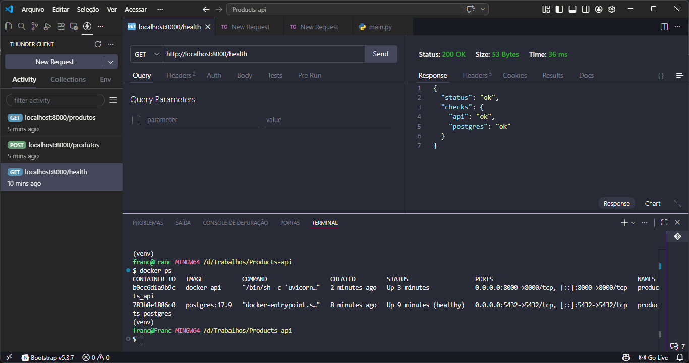
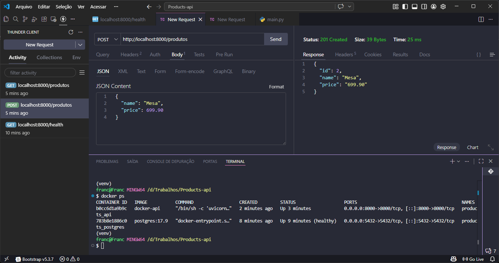
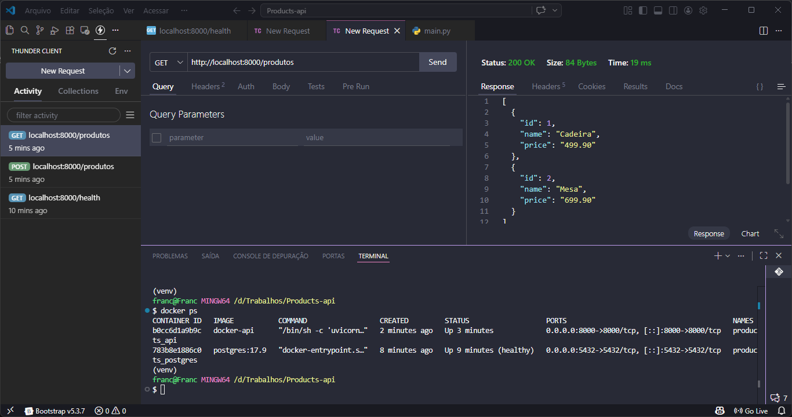

# Products-API

API simples para gerenciamento de produtos, construída com FastAPI, PostgreSQL e Docker-Compose para execução.

## Funcionalidades

- **healthcheck**: 
    Verifica se a API e do banco de dados estão up.
- **Criar Produto**: 
    Adicione um novo produto com nome e preço.
- **Listar os Produtos**: 
    Retorna uma lista com os produtos cadastrados no DB.

## Tecnologias

- **FastAPI**: Framework criação e doc. APIs assíncronas.
- **PostgreSQL**: Banco de dados relacional.
- **Docker**: Containerização.

## Para Executar
### O que você precisa ter

- Docker e Docker Compose instalados.

### Passo

1. Clone o repositório (ou navegue para a pasta do projeto).
2. Execute os containers:
   ```
   cd .docker
   docker-compose up --build
   ```
3. A API disponível em `http://localhost:8000`.

### Portas

- **Health Check**: `GET /health`

- **Criar Produto**: `POST /produtos/`

- **Listar os Produtos**: `GET /produtos/?skip=0&limit=10`


## Estrutura do Projeto

- `app/`
  - `main.py`: Ponto de entrada da API,
  - `models.py`: Modelos do banco de dados,
  - `schemas.py`: Schemas Pydantic para validação,
  - `actions.py`: Lógica,
  - `database.py`: Configuração do banco,
- `Dockerfile`: Imagem da API,
- `.docker/docker-compose.yml`: Orquestração dos containers,
- `requirements.txt`: Dependências do Python.

## Desenvolvimento

Para desenvolvimento local com venv (opcional):

1. Instale as dependências: `pip install -r requirements.txt`
2. Execute: `uvicorn app.main:app --reload`

### Vlww👍...